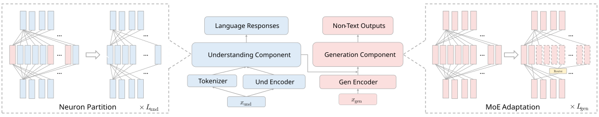

<h1 align="center">Understanding and Harnessing Sparsity in Unified Multimodal Models</h1>

<p align="center">
  <a href="https://arxiv.org/abs/2512.02351"></a>
  <a href="https://shwai-he.github.io/SparseUnifiedModel/"></a>
  
  
  
</p>

This repository contains the code and experiments for our work on **understanding and harnessing sparsity in unified multimodal models**, which studies redundancy and dynamic sparsity in models that jointly perform multimodal understanding and generation. The project analyzes how compression and adaptive computation can improve scalability and efficiency in unified multimodal architectures.

---

## 🔍 Overview

Unified multimodal models aim to integrate understanding (e.g., reasoning, classification) and generation (e.g., text-to-image synthesis, captioning) within a single architecture.
While this unification brings the promise of general-purpose multimodal intelligence, it also introduces inference inefficiencies due to task-specific activation, compute imbalance, and input variability.
Despite the recent progress, a systematic understanding of where and how these inefficiencies arise across different components remains limited.

This project conducts a comprehensive analysis of unified multimodal models using training-free pruning as a probing methodology, covering both depth pruning and width reduction.
Our study finds that:

- The understanding components—though crucial for reasoning—can be substantially compressed in generation tasks without severe degradation.
- The generation components, however, are highly sensitive to compression, with performance dropping sharply even under moderate pruning.
- To address this imbalance, we introduce Mixture-of-Experts (MoE) Adaptation, inspired by dynamic neuron activation patterns across samples. This approach partitions the generation module into multiple experts and activates them sparsely to recover performance.

As a result, our BAGEL model achieves comparable performance to the full model while activating only about half of its parameters, offering new insights into efficient unified multimodal modeling.



---

## 🤗 MoE Adaptation Checkpoints

| Model | Experts (Total → Active) | HuggingFace |
|-------|--------------------------|-------------|
| BAGEL-MoE-7B-GEN-16to8 | 16 → 8 | [LLM-Drop/BAGEL-MoE-7B-GEN-16to8](https://huggingface.co/LLM-Drop/BAGEL-MoE-7B-GEN-16to8) |
| BAGEL-MoE-7B-GEN-32to16 | 32 → 16 | [LLM-Drop/BAGEL-MoE-7B-GEN-32to16](https://huggingface.co/LLM-Drop/BAGEL-MoE-7B-GEN-32to16) |

---

## 📦 Installation

```bash
conda create -n efficient_ug python=3.10
conda activate efficient_ug

pip install -r requirements.txt
```

---

## 🧩 Supported Models

This repository integrates and adapts modeling files from [**BAGEL**](https://github.com/ByteDance-Seed/Bagel), [**Ming-Omni**](https://github.com/inclusionAI/Ming/tree/main), and [**Qwen-Image**](https://github.com/QwenLM/Qwen-Image) within a unified compression framework. Each model retains its original implementation style, with targeted modifications to support depth pruning, width reduction, and layer-level instrumentation via a shared `LayerCompressionMixin`.

| Model | Architecture | Location |
|-------|-------------|----------|
| BAGEL | Decoder-only unified multimodal LLM | `modeling/bagel/` |
| Ming-Omni | MoE-based multimodal LLM | `modeling/ming/` |
| Qwen-Image | Qwen2.5-VL text encoder + diffusion decoder | `modeling/qwen/` |

Shared compression instrumentation lives in `modeling/compression_mixin.py`.

---

## ⚙️ Core Techniques and Evaluation

This repository implements three core efficiency-oriented techniques:
**(1)** Depth Pruning via Layer Dropping,
**(2)** Width Reduction via Neuron Partitioning, and
**(3)** Expert Partitioning for MoE Preparation.

---

### 1. Depth Pruning via Layer Dropping

Reduces inference depth by identifying and dropping redundant layers based on cosine similarity of activations.

**Generation:**
```bash
bash scripts/eval/bagel/run_geneval_ld.sh
bash scripts/eval/ming/run_geneval_ld.sh
bash scripts/eval/qwen/run_geneval_ld.sh
```

**Understanding:**
```bash
bash scripts/eval/bagel/run_vlm_ld.sh
bash scripts/eval/ming/run_vlm_ld.sh
```

---

### 2. Width Reduction via Neuron Partitioning

Prunes less-active MLP neurons based on calibration statistics, producing a compact model that preserves task-specific expressiveness.

**Generation:**
```bash
bash scripts/eval/bagel/run_geneval_wr.sh
bash scripts/eval/ming/run_geneval_wr.sh
bash scripts/eval/qwen/run_geneval_wr.sh
```

**Understanding:**
```bash
bash scripts/eval/bagel/run_vlm_wr.sh
bash scripts/eval/ming/run_vlm_wr.sh
```

**Neuron partitioning script:**
```bash
python scripts/neuron_partition.py
```

---

### 3. Expert Partitioning for MoE Preparation

Converts dense MLP modules into sparse expert-based structures to enable MoE adaptation and sparse activation.

```bash
# Interactive example
notebooks/dense2sparse.ipynb
```

---

## 📂 Code Structure

```
SparseUnifiedModel/
├── modeling/                   # All model architectures and weights
│   ├── bagel/                  # BAGEL (unified multimodal LLM)
│   ├── ming/                   # Ming-Omni (MoE multimodal LLM)
│   ├── qwen/                   # Qwen-Image text encoder
│   ├── qwen2/                  # Base Qwen2 language model
│   ├── siglip/                 # SigLIP vision encoder
│   ├── diffusers/              # Vendored diffusers (Qwen pipeline infrastructure)
│   └── compression_mixin.py   # Shared layer drop / pruning instrumentation
│
├── eval/
│   ├── gen/                    # Unified generation evaluation (all models)
│   │   ├── gen_images.py       # Width reduction evaluation
│   │   ├── gen_images_ld.py    # Layer drop evaluation
│   │   ├── compress_utils.py   # Shared compression utilities
│   │   └── models/             # Per-model wrappers (bagel, ming, qwen)
│   └── vlm/                    # Multimodal understanding evaluation
│
├── scripts/
│   ├── eval/                   # Shell scripts (bagel / ming / qwen)
│   ├── inferencer.py           # BAGEL inference interface
│   └── neuron_partition.py     # Neuron importance scoring and partitioning
│
├── tools/
│   ├── ming_sdk/               # Ming SDK for deployment
│   ├── vllm/                   # vLLM integration patches
│   ├── diffusion/              # Custom diffusion pipelines (SANA, SD3)
│   └── gradio_demo.py          # Interactive Ming demo
│
├── notebooks/
│   ├── dense2sparse.ipynb      # Dense → MoE expert partitioning walkthrough
│   ├── inference_bagel.ipynb   # BAGEL inference examples
│   ├── inference_qwen.ipynb    # Qwen-Image inference examples
│   └── inference_ming.ipynb    # Ming-Omni inference examples
│
├── data/                       # Data utilities and example prompts
├── docs/                       # Project page and figures
├── utils/                      # Shared utility functions
└── requirements.txt
```

---

## 📬 Contact

For questions or collaborations, feel free to reach out:  
📧 **shwai.he@bytedance.com**, **sheny@bytedance.com**
