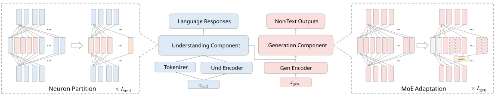

<h1 align="center">Understanding and Harnessing Sparsity in Unified Multimodal Models</h1>

<p align="center">
  <a href="https://arxiv.org/abs/2512.02351"></a>
  
  
  
</p>


This repository contains the code and experiments for our work on **understanding and harnessing sparsity in unified multimodal models**, which studies redundancy and dynamic sparsity in models that jointly perform multimodal understanding and generation. The project analyzes how compression and adaptive computation can improve scalability and efficiency in unified multimodal architectures.

---

## 🔍 Overview

Unified multimodal models aim to integrate understanding (e.g., reasoning, classification) and generation (e.g., text-to-image synthesis, captioning) within a single architecture.
While this unification brings the promise of general-purpose multimodal intelligence, it also introduces inference inefficiencies due to task-specific activation, compute imbalance, and input variability.
Despite the recent progress, a systematic understanding of where and how these inefficiencies arise across different components remains limited.

This project conducts a comprehensive analysis of unified multimodal models using training-free pruning as a probing methodology, covering both depth pruning and width reduction.
Our study finds that:

- The understanding components—though crucial for reasoning—can be substantially compressed in generation tasks without severe degradation.

- The generation components, however, are highly sensitive to compression, with performance dropping sharply even under moderate pruning.

- To address this imbalance, we introduce Mixture-of-Experts (MoE) Adaptation, inspired by dynamic neuron activation patterns across samples.
This approach partitions the generation module into multiple experts and activates them sparsely to recover performance.
Through expert-frozen tuning and fully trainable adaptation, we show that sparse activation restores generation quality while maintaining efficiency.

As a result, our BAGEL model achieves comparable performance to the full model while activating only about half of its parameters, offering new insights into efficient unified multimodal modeling.



--- 
##  📦 Installation

```bash
conda create -n efficient_ug python=3.10
conda activate efficient_ug

pip install -r requirements.txt
```

---

## 🧩 Modeling Files

This repository integrates and adapts modeling files from [**BAGEL**](https://github.com/ByteDance-Seed/Bagel), [**Ming-Omni**](https://github.com/inclusionAI/Ming/tree/main), and [**Qwen-Image**](https://github.com/QwenLM/Qwen-Image) for unified multimodal experimentation.  
Each model retains its original implementation style, while we introduce targeted modifications to ensure **compatibility**, **efficiency**, and enable **depth pruning** and **width reduction** within a unified compression framework.

The corresponding modified files are listed below:

- **BAGEL** → `modeling/bagel/bagel.py`  
- **Ming-Omni** → `Ming/modeling_bailingmm.py`  
- **Qwen-Image** → `diffusers/pipelines/qwenimage/modeling_qwen2_5_vl.py`  

These adaptations provide consistent layer and dimension interfaces across heterogeneous architectures, allowing fine-grained control of model components during pruning and compression analysis.

---

## ⚙️ Core Techniques and Evaluation

This repository implements three core efficiency-oriented techniques for unified multimodal models:  
**(1)** Depth Pruning via Layer Dropping,  
**(2)** Width Reduction via Neuron Partitioning, and  
**(3)** Expert Partitioning for MoE Preparation.  

Each method includes corresponding evaluation scripts for both **understanding** and **generation** tasks.

---

### Depth Pruning via Layer Dropping
Reduces inference depth while maintaining reasoning and multimodal understanding capabilities.

**Evaluation Commands**
- **Understanding:**  
  ```bash
  bash eval/vlm/evaluate_ld.sh

- **Generation:**  
  ```bash
  bash scripts/eval/bagel/run_geneval_ld.sh
  bash scripts/eval/ming/run_geneval_ld.sh
  bash scripts/eval/qwen/run_geneval_ld.sh

### Width Reduction via Neuron Partitioning

Prunes less active neurons for the current task to produce a compact yet expressive model that preserves task-specific diversity.

**Evaluation Commands**

- **Understanding:**  
  ```bash
  bash eval/vlm/evaluate.sh

- **Generation:**  
  ```bash
  bash scripts/eval/bagel/run_geneval_wr.sh
  bash scripts/eval/ming/run_geneval_wr.sh
  bash scripts/eval/qwen/run_geneval_wr.sh

Example usage for partitioning neurons in understanding and generation components is provided in the scripts above.

- **Example of partitioning neurons for understanding and generation**:
  ```bash
  neuron_partition.py

---

### Expert Partitioning for MoE Preparation

Partitions the generation component into multiple experts to facilitate MoE adaptation, enabling sparse activation and improving flexibility during subsequent expert-based fine-tuning.

- **Notebook Example**
  ```
  dense2sparse.ipynb
This notebook provides a practical example of converting dense modules into sparse expert-based structures for adaptive computation

#### 🤗 Pretrained MoE Checkpoints

| Model | Experts (Total → Active) | HuggingFace |
|-------|--------------------------|-------------|
| BAGEL-MoE-7B-GEN-16to8 | 16 → 8 | [LLM-Drop/BAGEL-MoE-7B-GEN-16to8](https://huggingface.co/LLM-Drop/BAGEL-MoE-7B-GEN-16to8) |
| BAGEL-MoE-7B-GEN-32to16 | 32 → 16 | [LLM-Drop/BAGEL-MoE-7B-GEN-32to16](https://huggingface.co/LLM-Drop/BAGEL-MoE-7B-GEN-32to16) |


## 📂 Code Structure

```bash
SparseUnifiedModel/  
├── modeling/ # Core model definitions (BAGEL, Ming-Omni, Qwen-Image)  
│ └── bagel/ # Adapted BAGEL model implementation  
│  
├── Ming/ # Ming-Omni modeling files  
│ └── modeling_bailingmm.py  
│  
├── diffusers/ # Adapted Qwen-Image modeling and supporting modules  
│ └── pipelines/qwenimage/ # Unified multimodal generation pipelines  
│ ├── modeling_qwen2_5_vl.py  
│ ├── pipeline_qwenimage.py  
│ └── pipeline_qwenimage_img2img.py  
│  
├── data/ # Data utilities for loading and preprocessing multimodal inputs  
│ ├── data_utils.py  
│ └── transforms.py  
│  
├── eval/ # Evaluation scripts for understanding and generation tasks  
│ ├── vlm/ # Multimodal understanding evaluation  
│ └── scripts/ # Generation task evaluations (e.g., Bagel/Ming/Qwen)  
│  
├── scripts/ # Shell scripts for task-specific evaluation  
│ ├── eval/bagel/  
│ ├── eval/ming/  
│ └── eval/qwen/  
│  
├── utils/ # Utility functions shared across models and tasks  
│  
├── dense2sparse.ipynb # Expert partitioning and dense-to-sparse MoE preparation  
├── neuron_partition.py # Neuron importance and partitioning for width reduction  
├── inference_bagel.ipynb # Example inference workflow for BAGEL  
├── inference_qwen.ipynb # Example inference workflow for Qwen-Image  
├── inferencer.py # Unified inference interface  
│  
├── efficient_ug.svg # Architecture overview illustration  
├── prompts.txt # Example input prompts  
├── requirements.txt # Environment dependencies  
├── LICENSE  
└── README.md  
```

## 📬 Contact Us
For any questions or collaborations, feel free to reach out:  
📧 **shwai.he@bytedance.com**, **sheny@bytedance.com**
